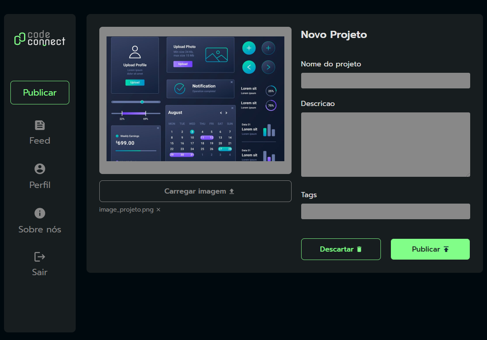

# Javascript Assincrono 🍅

> Um dos meu primeiros sites com javascript, feito para aprender sobre async, await e promises. A proposta é um formulario de envio de post, com um preview da imagem a ser enviada.

## 👨‍💻 Desenvolvido por:

<table>
  <tr>
    <td align="center">
      <a href="https://www.linkedin.com/in/samuelmachadoduarte/" title="Meu linkedin">
         
        
          <b>Samuel Machado</b>
        
      </a>
    </td>
  </tr>
</table>
